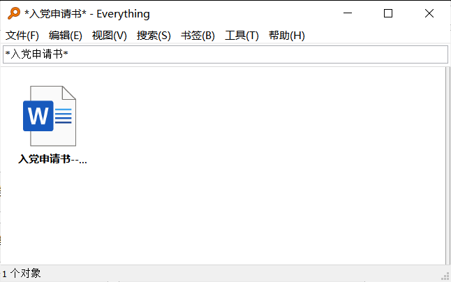
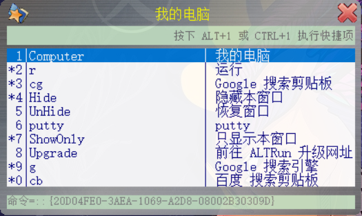
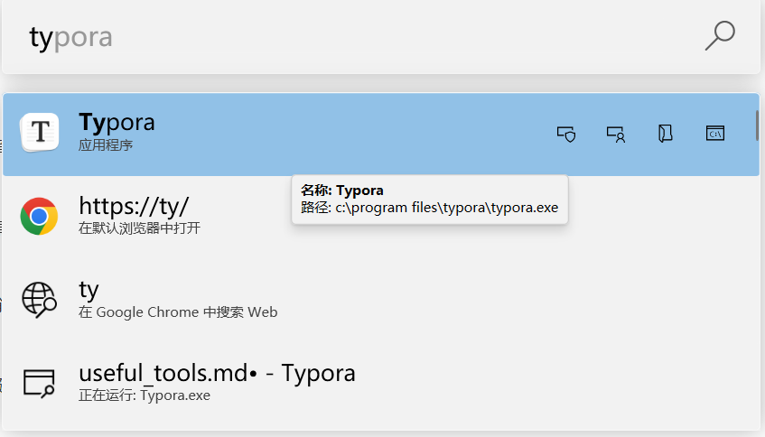
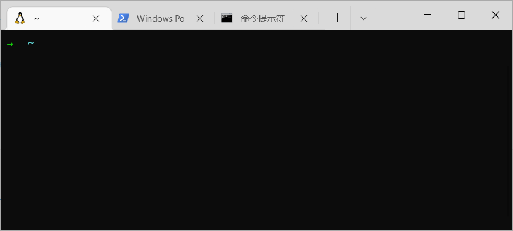

# 磁盘、文件管理

- **everything**

  快速扫描整个磁盘，根据名字查找需要的文件，可以组合正则表达式。并且只有几M。（尤其是需要找很久之前的文件）

  下载链接：https://www.voidtools.com/zh-cn/downloads/

  

  

  

- **windirstat**

  用来分析磁盘，简单找出占比大的文件

- **spacesniffer**

  磁盘空间分析工具，以可视化形式分析磁盘内各个文件的大小

- **geek**

  超小卸载工具，能够卸载干净

- **ALTrun**

  自定义打开各种exe、sh甚至指令（比如关机、重启），可以快捷键打开ALTrun，快速打开各种文件。只有几M。 

  可以对程序改名，比如你有好几种绘图软件，你可以取名paint-x，paint-y，paint-z，输入paint时，就有关联输入提示（就算隔很久你忘记名字了也能找到）

  

- **PowerToys**

  和ALTrun类似，替代左下方的搜索框，可以用快捷键打开（可以在PowerToys run设置），快速搜索，打开应用程序

  

# 笔记

- **notion**

  笔记软件，拓展性极强，免费，多平台云同步

- **Typora**

  做笔记的软件，优点是简洁，实时能看到样式。缺点是新版要钱（以前的版本不需要），线上存储不方便。

- **Draw.io**

  可以和Typora搭配使用，可以画流程图，风格等等，免费

  下载链接：https://blog.csdn.net/qq_41740883/article/details/117408102

- **obisidian**

  体系化结构笔记 自动生成时序图 关系图谱，有实用门槛

# 编程相关

- **Terminal**

  终端管理器，可以使用多个终端

  

- **wsl**

  在windows电脑上使用linux子程序（如上图）

- **vscode**

  编程。在wsl里面 `code .`可以在当前目录启动vscode

- **Docker**

  容器虚拟化技术（比较常用的技术栈，有学习门槛），方便进行整体环境的迁移。

  可以使用Docker一键构建开发、测试环境，一些深度学习开源库也有基于Docker技术的构建方式（如图像分割的Detectron2）。

  可以用Docker搭建服务器，每个用户的环境都在Docker上，节省存储空间，方便集中管理，有利于环境迁移。

  学习链接：https://www.bilibili.com/video/BV1og4y1q7M4?spm_id_from=333.999.0.0

  官网：https://www.docker.com/

  

# 绘图

- **snipaste**

  截图、贴图、取色小工具

  下载链接：https://www.snipaste.com/

- **careUeyes **

  (需要破解)---调整屏幕亮度、色彩度等

  下载链接：https://www.jb51.net/softs/673067.html

  

